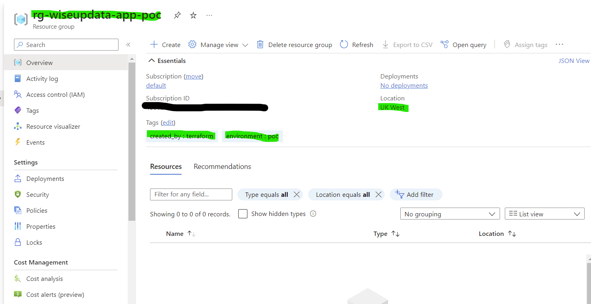

# **Generate a simple resource group**

> Version: 0.0.1

<br>

Simple example:

main.tf
```
module "rg" {
  source       = "wiseupdata/simple-resource-group/azurerm"
  version      = "v0.0.1"
  company_name = "wiseupdata"
}
```

```
terraform init
terraform fmt
terraform validate
terraform plan -output plan.output
terraform apply plan.output
```




# Clean the resource.

```
terraform destroy
rm main.tf
```